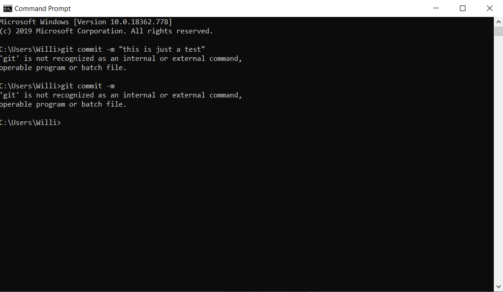

# Journal

Today I performed the scenario where we have to submit a help ticket. I wanted to commit a file to my github, so I went into the command prompt and attempted to commit using git commit -m "this is a test", however it gave me this error:  

So I then googled the error I got and came accross [this helpful article](https://stackoverflow.com/questions/4492979/git-is-not-recognized-as-an-internal-or-external-command) where I learned where I went wrong.
As I've learned from my limited coding experience from highschool, StackOverflow is a very helpful and useful website for dealing with coding and command errors.
